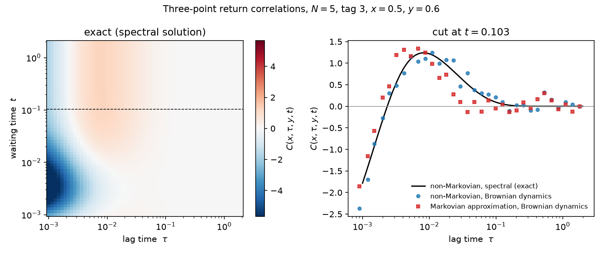
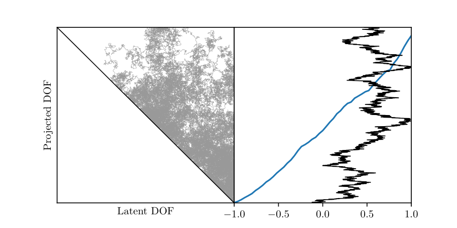
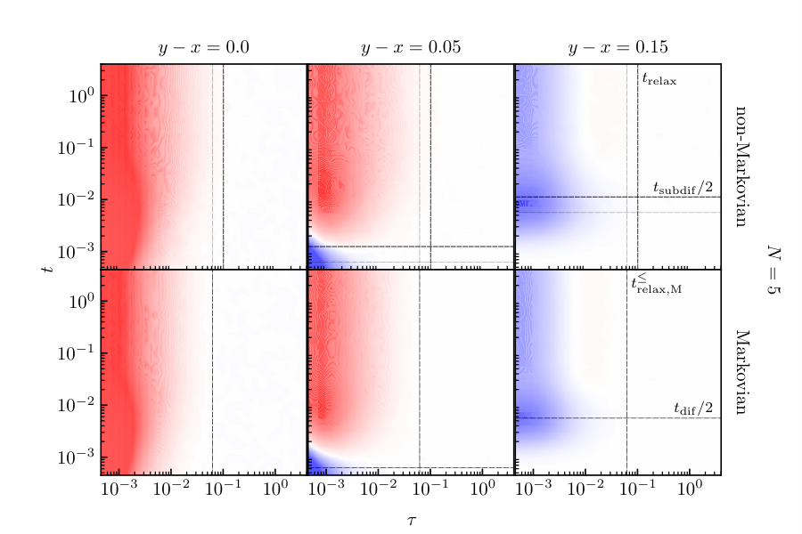

# Three-point return correlations in single-file diffusion

Scientific code for two independent computations of the same observable in the
single-file diffusion model, a stochastic many-body system: an exact spectral
solution in C++ and a Brownian dynamics simulation in Julia. Written in 2021 for
my master's thesis.



## What's in here

| Path | Contents |
|---|---|
| [**`spectral/`**](spectral/README.md) | Exact solution in C++: vendored BetheSF plus my extension. |
| [**`bd/`**](bd/README.md) | Brownian dynamics in Julia, for the full single file and its Markovian approximation, plus the HDF5 layer that merges runs exactly. |
| [**`cluster/`**](cluster/README.md) | The Sun Grid Engine array-job scripts the results were produced with, and the scale they ran at. |
| [`figures/`](figures) | The figure above with its data and plotting script, and the thesis figures in [`figures/thesis/`](figures/thesis). |
| [`NOTICE.md`](NOTICE.md) | Which code is Lapolla and Godec's, which is mine, and how to check. |

Each folder's README covers usage, design notes and known limitations.

## What the work involved

- **Extending an unfamiliar C++ codebase.** BetheSF solves two-point
  propagators. Three-point return correlations needed new spectral machinery
  added inside 1,400 lines of someone else's templates and combinatorics,
  without disturbing what was already there.
- **No reference to check against.** Nobody had computed this observable before,
  so the check had to be a second implementation sharing no code, no language
  and no numerical method with the first. The two [agree to 2%](#cross-check),
  which is the Monte Carlo noise floor.
- **Efficiency was the binding constraint.** The many-body overlap elements are
  factorial in `N`. Hoisting them out of the evaluation grid is
  [33x](spectral/README.md#what-the-code-does), and precomputing them in
  parallel another 4.3x on 8 threads. The exact method still stops at `N = 5`,
  which is why the simulation exists.
- **Cluster scale.** 56 million trajectories and 3.5 x 10^13 particle-position
  updates, with single spectral jobs running up to 478 hours against a 500-hour
  queue limit. Integer accumulators in `bd/` and eigenvalue-shell decomposition
  in `spectral/` exist so that work could be split across jobs and merged back
  exactly. Job scripts and the full cost tables are in
  [`cluster/`](cluster/README.md).

## The observable

Take `N` hard-core Brownian particles on the unit interval, unable to pass each
other. Watch one of them. The other `N-1` have been projected away, so the
motion you see is subdiffusive and carries memory: the tagged particle is
non-Markovian even though the full `N`-particle system is Markovian.



*What projection does, in two dimensions: a walk confined to a wedge, with one
coordinate integrated out. The visible coordinate inherits a force it never had,
and a memory of where the hidden one was.* (`figures/projection.jl`)

The observable is the three-point return correlation

```
C(x,tau,y,t) = Q(x,t+tau ; y,t | x)  -  Q(x,t+tau | x) Q(y,t | x)
                    connected                   disconnected
```

which asks about the loop `(x,0) -> (y,t) -> (x,t+tau)`: does the tagged
particle make that round trip within one trajectory more often than two
independent trajectories each doing half of it?

```
C > 0   the loop is more probable than an independent loop
C = 0   as probable
C < 0   less probable
```

The disconnected part conditions both propagators on `x`. A chain,
`Q(x,tau|y) Q(y,t|x)`, would measure non-Markovianity instead; conditioning both
on `x` makes `C` a statement about return loops.

For comparison, the same observable is computed for a Markovian approximation:
one particle in the potential of mean force `U_M = -log P_ss`, which has the
same stationary distribution as the tagged particle. Same equilibrium, no
memory.

## The two methods

|  | [`spectral/`](spectral) (C++) | [`bd/`](bd) (Julia) |
|---|---|---|
| what it gives | exact, up to spectral truncation | Monte Carlo estimate |
| how | coordinate Bethe ansatz, eigenmode sum | Euler–Maruyama, sort-based hard-core |
| reaches | `N <= 5` in practice | `N = 61` in the thesis |
| cost | hours to weeks per parameter set | minutes to hours |
| Markovian approximation | not available in closed form | yes |

Every physics result in the thesis came from the simulation. The spectral code
produced none of them.

## Quickstart

```bash
# exact, ~9 s
(cd spectral && make && ./example)

# simulation, a few minutes
(cd bd && julia example.jl)

# the figure above
(cd figures && python3 plot.py)
```

The C++ needs a C++17 compiler and optionally OpenMP. The simulation engine
needs nothing beyond the Julia standard library; only `bd/accumulate.jl`, which
merges results across runs, needs a package (HDF5.jl). The plot script needs
matplotlib.

## Results

Figures from the thesis, all produced by the Brownian dynamics code. `C` in the
`(t, tau)` plane, non-Markovian above, Markovian approximation below, for three
separations `y-x`:



The two are qualitatively identical, which is the main finding. Three of the
four temporal limits of `C` are fixed by its definition whatever the dynamics.
Two quantitative differences survive:

1. the relaxation time in `tau` is independent of `N` for the tagged particle,
   whereas `t_relax,M` *decreases* with `N` in the Markovian approximation
2. correlations vanish later in `t`, because subdiffusion slows the tagged
   particle down

Both grow under non-equilibrium initial conditions. More figures, covering
`N = 21`, the non-equilibrium case, sample trajectories, the subdiffusive window
and the potential of mean force, are in [`figures/thesis/`](figures/thesis).

## Cross-check

Two-point propagator `Q(x,t|x0)` for `N=5`, tag 3, `x0=0.5`, from 60,000 BD
trajectories against the spectral solution at `max_many_eig=49`:

```
   x |  BD t=0.005  spectral |  BD t=0.02  spectral |  BD t=0.1  spectral
0.40 |      2.3542    2.3760 |     2.2533    2.2195 |    1.7392    1.7809
0.50 |      4.8308    4.7070 |     2.8950    2.8717 |    1.9250    1.9621
0.60 |      2.2550    2.3760 |     2.1292    2.2195 |    1.7775    1.7809

mean |BD - spectral| / mean spectral:  2.5% (t=0.005)  1.5% (t=0.02)  2.0% (t=0.1)
```

That is the Monte Carlo noise floor at 60,000 trajectories. The right-hand panel
of the figure at the top shows the same agreement for `C` itself.

## Provenance and state of the code

`spectral/BetheSF/` is Lapolla and Godec's
[BetheSF](https://data.mendeley.com/datasets/3bs74vf72n/2) (MIT). My extension
lives in
[`SingleFileCorrelations.cpp`](spectral/BetheSF/SingleFileCorrelations.cpp)
under my own copyright. The only other code of mine in their files is a fenced
block of declarations in `SingleFile.hpp`, which C++ requires for member
functions. [`NOTICE.md`](NOTICE.md) gives the full account and how to verify it
against upstream. Everything in `bd/` is mine.

The code is tidied but not rewritten. I deleted dead and duplicated functions
and stripped profiling scaffolding; nothing else changed. Known weak spots (a
linear scan in a hot loop, an unparallelised trajectory loop, a static OpenMP
schedule that oversubscribes) are documented in the relevant README rather than
quietly fixed, so that what you read is what produced the results.

## Reference

Janik Schüttler, *Analysis of Three-Point Return Correlations in Single-File
Diffusion*, MSc thesis, ETH Zurich, 2021. Carried out at the Max Planck
Institute for Biophysical Chemistry, Göttingen, supervised by Aljaž Godec.

Built on:

- A. Lapolla and A. Godec, *Manifestations of Projection-Induced Memory: General
  Theory and the Tilted Single File*, Front. Phys. **7** (2019)
- A. Lapolla and A. Godec, *Unfolding tagged particle histories in single-file
  diffusion*, New J. Phys. **20**, 113021 (2018)

## Licence

MIT, as is the code it builds on.
